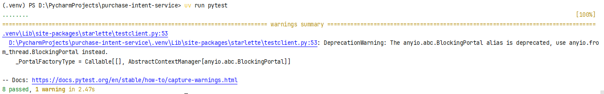
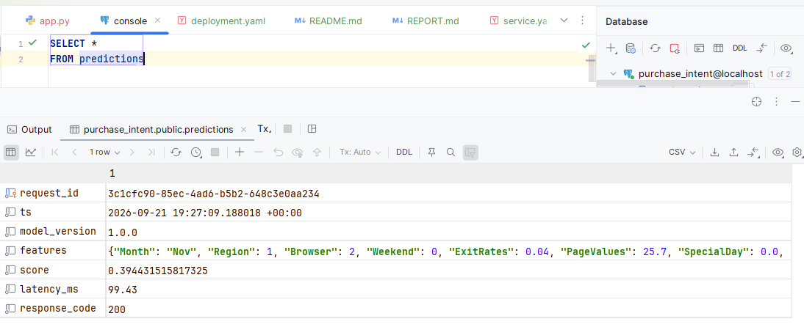
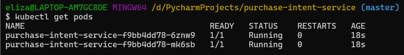
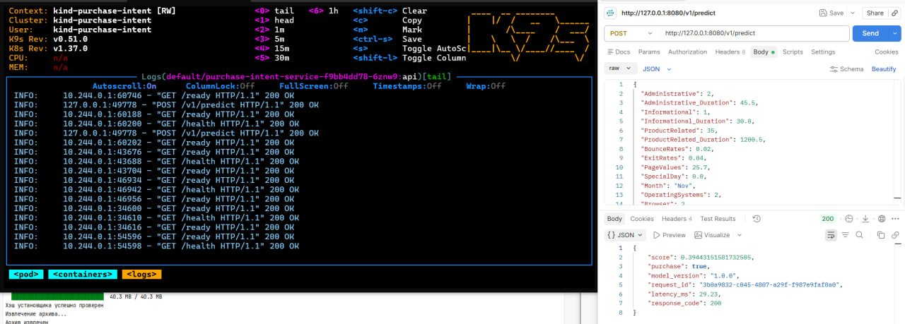
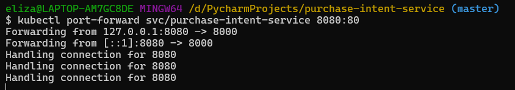
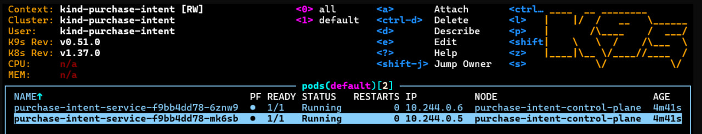
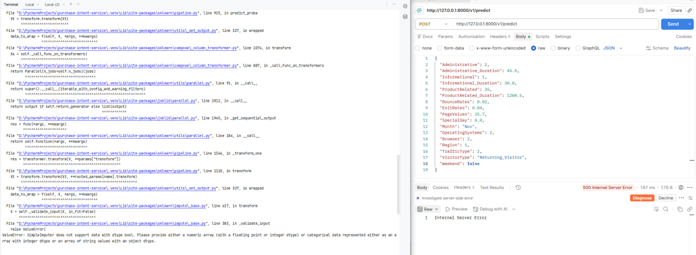

# Отчет о выполнении проекта

## pytest

## SELECT из логов

## get pods

## ответ predict через port-forward

## скрин k9s

## журнал проблем

### проблема 1 - в запросе параметр приходит как bool, а модель обучалась на int (0/1)

РЕШЕНИЕ: Починилось путем добавления в predict (в app.py) cast bool -> int
